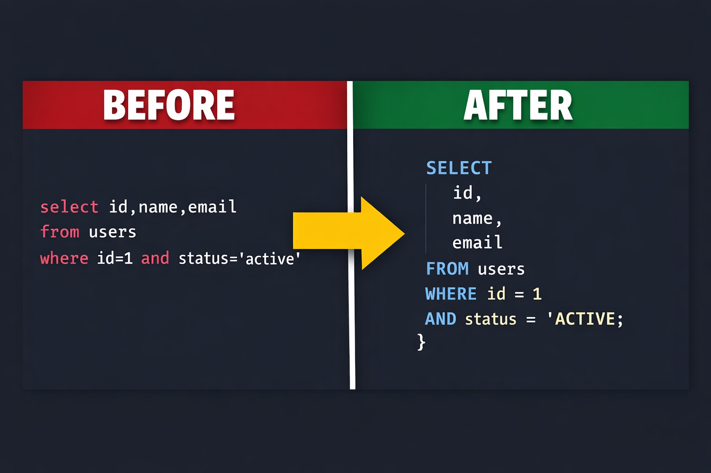
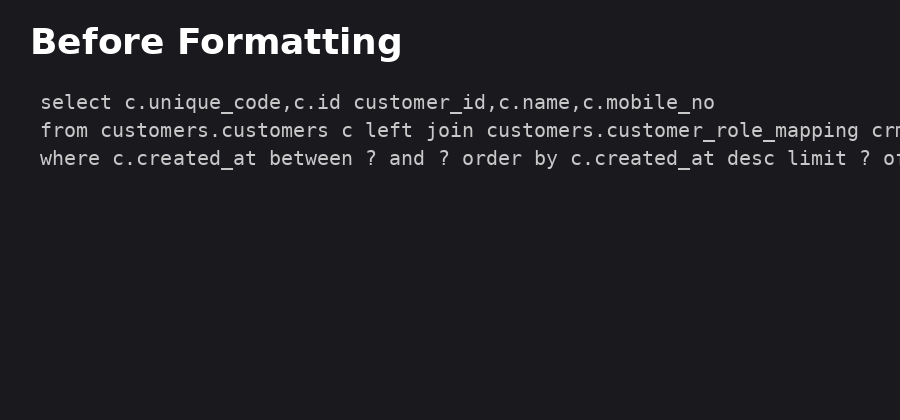

# Universal SQL Prettier

Format SQL queries anywhere in your codebase.

## Features

* SQL keyword normalization
* SQL prettification
* Broken SQL repair
* Multi-selection formatting
* SQL formatting inside code blocks
* Dialect support

Supported dialects:
* PostgreSQL
* MySQL
* SQLite
* T-SQL

## Demo




<p align="center">
  
</p>

## Commands

| Command          | Shortcut        |
| ---------------- | --------------- |
| Format SQL Query | Ctrl + Alt + P  |
| Format Document  | Shift + Alt + F |

## Example

Before:
```sql
select id,name from users where id=1
```

After:
```sql
SELECT
  id,
  name
FROM users
WHERE id = 1
```

## Settings

`sqlFormatter.dialect` - Choose SQL dialect (postgresql, mysql, sqlite, tsql)

Example:
```json
{
  "sqlFormatter.dialect": "postgresql"
}
```

## License

MIT
